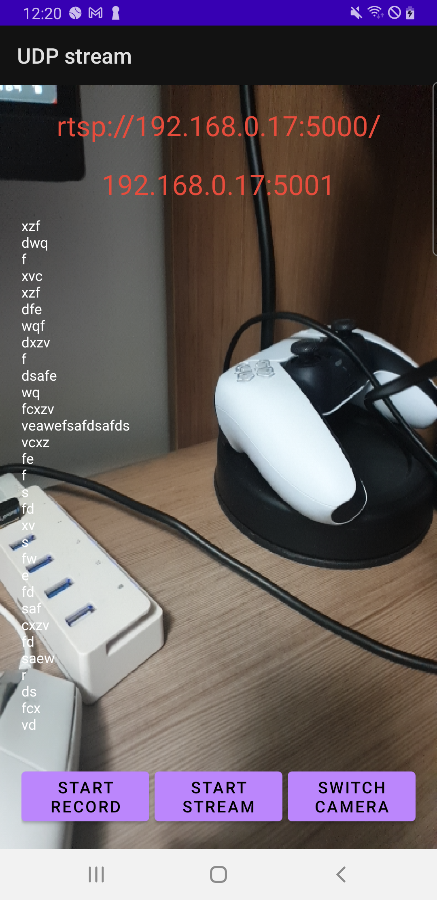
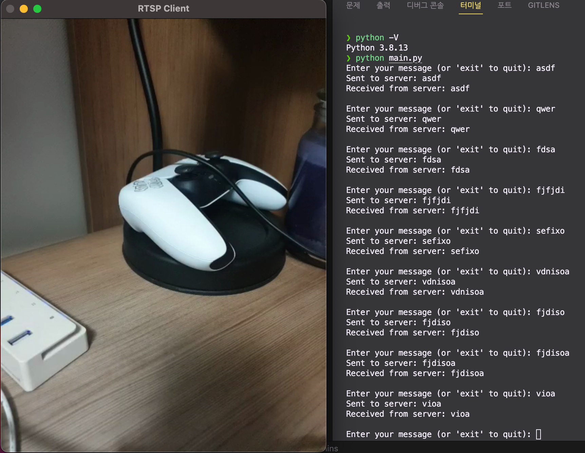

# python-rtsp-client
PC RTSP 클라이언트 어플리케이션

[android-rtsp-server](https://github.com/alsrb968/android-rtsp-server)

## 동작 화면
<p align="center">
  
  
  <figcaption align="center">실행 화면 (좌: 안드로이드 서버, 우: PC 클라이언트)</figcaption>
</p>

# 요구사항
- python 3

## Python 가상환경 생성
```
python -m venv venv
```

## Python 가상환경 활성화

### Windows
```
venv\Scripts\activate.bat
```

### Linux, Mac
```
source venv/bin/activate
```

## 패키지 설치
```
pip install -r requirements.txt
```

## 실행
```
python main.py
```